# Module graph view

Source-file dependencies of the firmware (build-time includes and
call-level coupling; `platformio.ini` selects which parts are active).

```mermaid
flowchart TB
    subgraph drivers["CMT2300A driver (one class, three files)"]
        INIT["cmt2300a_init.cpp<br/>begin(): reset, RFPDK map,<br/>Control Bank, FIFO merge, ISR"]
        SPI["cmt2300a_spi.cpp<br/>registers/FIFO, state machine,<br/>setFrequencyHz (kBands)"]
        HDR["include/cmt2300a.h<br/>register + IRQ constants"]
        CFG["include/cmt2300a_config.h<br/>RFPDK profiles (EBYTE / OMS T1)"]
    end

    MAIN["main.cpp<br/>mode orchestration: WebUI,<br/>SWFRAM windows, feed, repair,<br/>beacon TX"]

    HCI["im871a_hci.cpp<br/>HCI FSM, RSP/IND emitters,<br/>TX path, detect gates"]

    MAIN --> INIT
    MAIN --> SPI
    MAIN --> HCI
    HCI --> SPI
    INIT --> SPI
    INIT --> CFG
    SPI --> HDR
    HCI --> HDR
```

- File purposes: `docs/agents/project-specs.md` → "Architecture Overview".
- Register-layout policy: [ADR 0005](../adr/0005-ebyte-register-layout-wins.md).