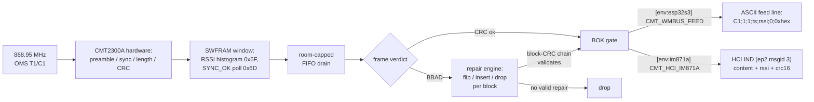

# RX data-flow view

From on-air frame to consumer. The BOK gate is the quality boundary —
nothing CRC-dirty leaves the firmware ([ADR 0006](../adr/0006-false-fire-zero-policy.md)).

- Window/verdict mechanics: `src/main.cpp` (`CMT_SWFRAM` section,
  `platformio.ini:71`), repair flag `platformio.ini:80`.
- Prose detail: `docs/agents/project-specs.md` → "wM-Bus production mode".