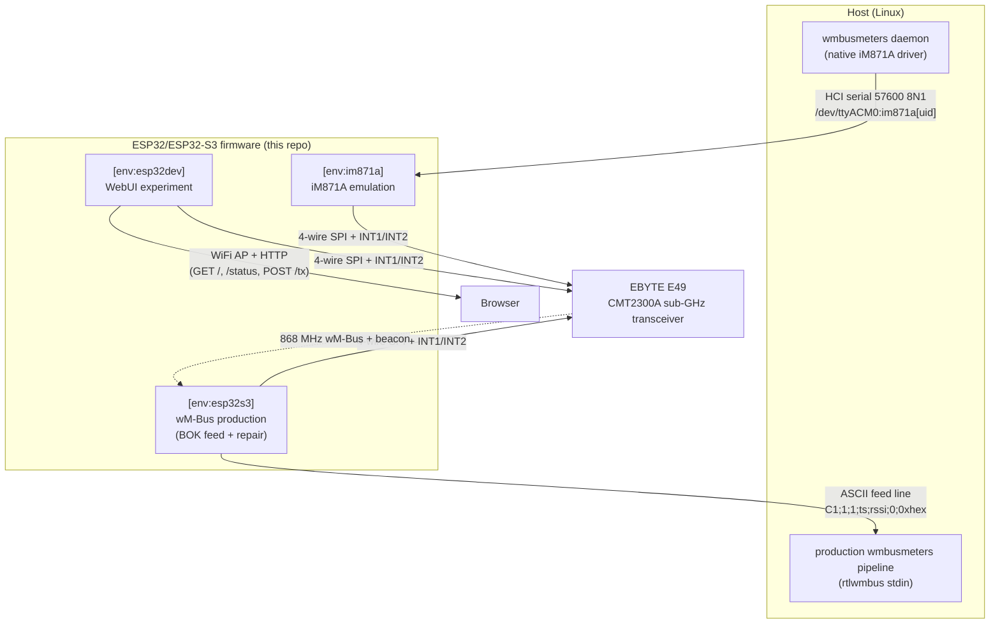

# System context view

One radio silicon, three firmware personalities. Each PlatformIO env
selects a mode (`platformio.ini`); the CMT2300A driver is common to all.

- Which env gets flashed where: `docs/agents/project-specs.md` →
  "Build Commands" and "Runtime Configuration / Usage".
- Why the emulation mode exists: [ADR 0003](../adr/0003-im871a-emulation-as-dongle-path.md).
- Why the feed is BOK-gated: [ADR 0006](../adr/0006-false-fire-zero-policy.md).